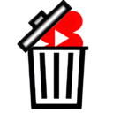
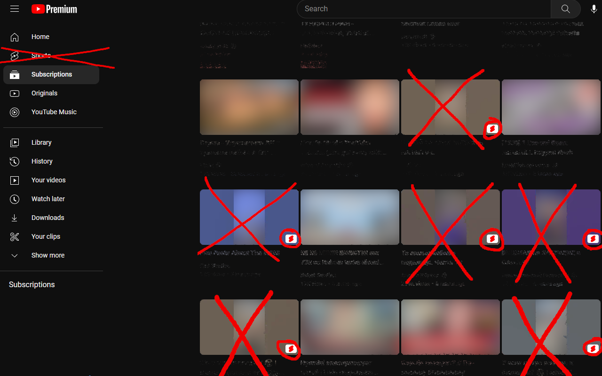
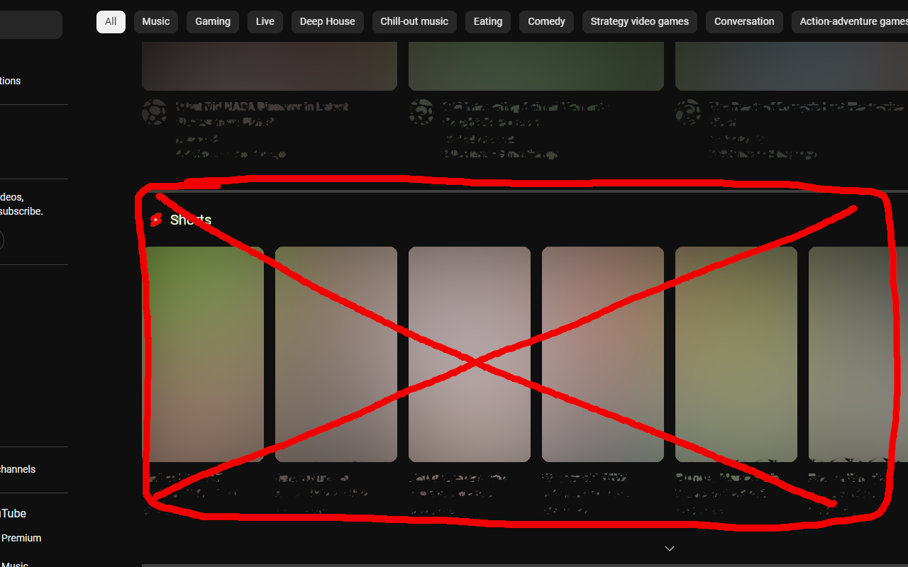

# Remove Shorts plugin 

Upon the release of Youtube shorts, I initially embraced the concept with enthusiasm. However, I soon realized that the addictive nature of shorts was negatively impacting my productivity. Despite attempts with a friend to teach the Youtube algorithm our disinterest by clicking the "not interested" button, the shorts continued to be recommended to us.  
 
Eventually, my frustration with Youtube shorts reached a boiling point, leading me to take drastic measures to eliminate them from my feed. To achieve this, I developed a plugin (currently available only for Google Chrome) that effectively removes any and all references to shorts from users Youtube experience.
  

 

## Disclamer
All content related to **Youtube**, **Youtube Shorts**, and **Google** are the intellectual property of their respective owners. The use of these trademarks, registered trademarks, brand names, and logos in this plugin is for identification purposes only and does not imply endorsement or affiliation with the owners or rights holders. Any use of these trademarks, registered trademarks, brand names, and logos in this plugin is done so in good faith, and we acknowledge the rights of their owners.
